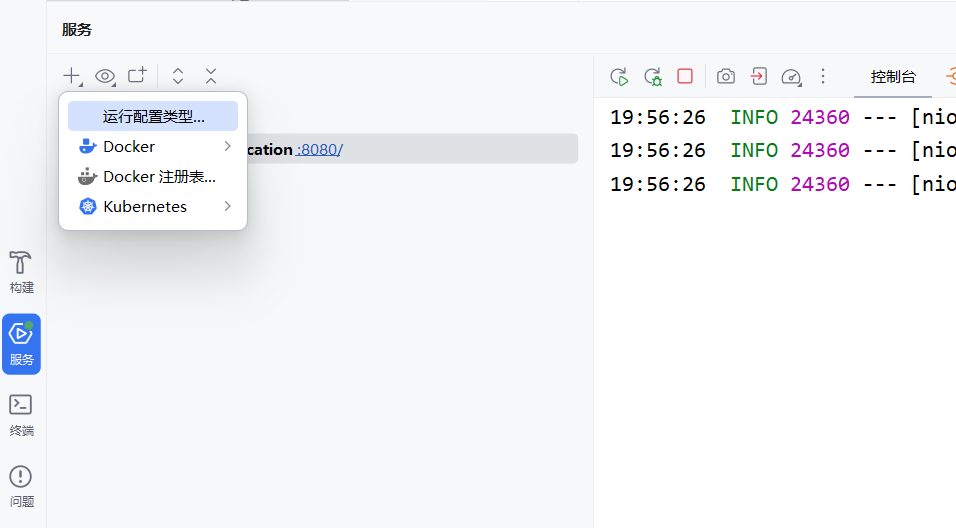
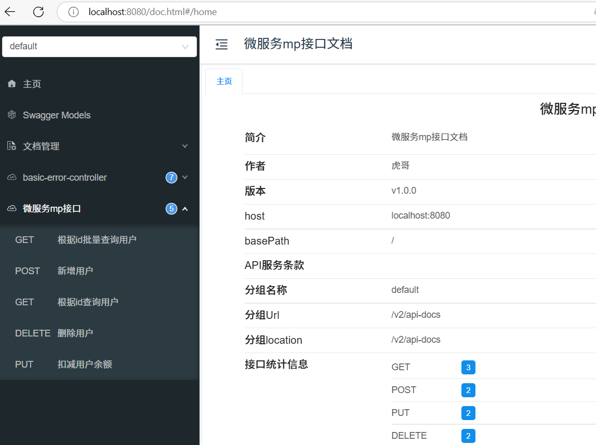
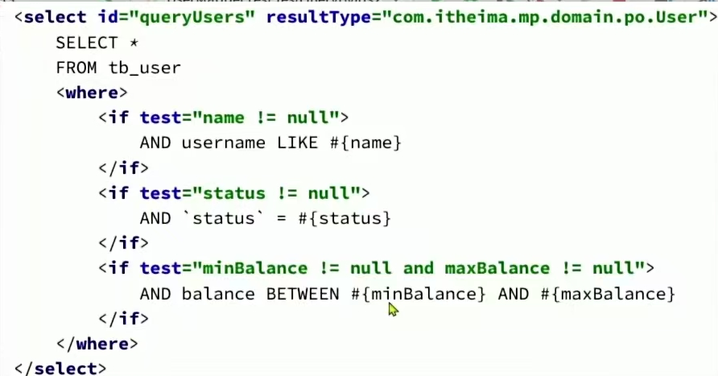
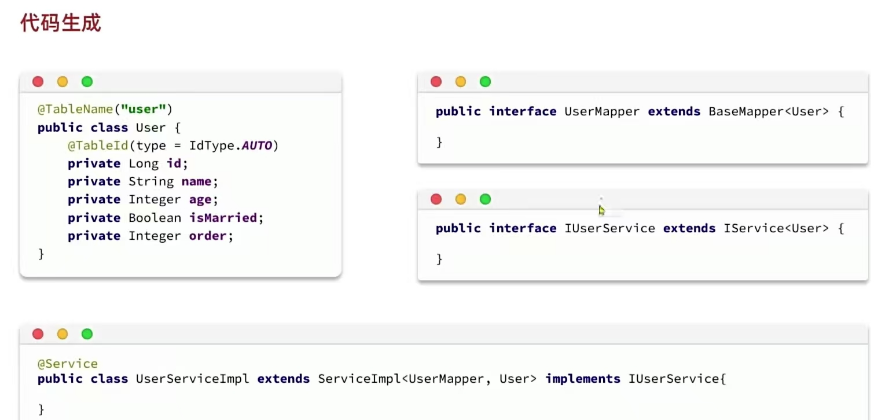

## 一、入门step

### 1.打框架

### 2.引入依赖

### 3.开始写功能

## 二、接口测试

### 1.alt+8快捷键打开springboot启动测试

### 2.点击：8080/进入swagger网页版接口区，路径输入如图（盲猜和配置文件设置对象有关）。idea写过的接口都会显示在图中。

## 三、mp练习

### 1.使用IService自带的增删改查等**基础sql**

功能：

- 新增用户
- 删除用户
- 根据id查询用户
- 根据ids批量查询用户
- 扣减用户余额

### 2.lombok取代写死的sql，实现**自定义sql，动态sql**

功能：

- 根据userQuery动态查询用户集

### 3.配置文件修改参数实现**批处理功能**

批量插入10w条数据，在MpDemoApplicationTests测试文件里

批量删除10w条数据，delete from tb_user where id>8

## 四、mp进阶

### 1.**代码生成器**简化开发

- 框架是固定的，可以用代码生成器替我们写

- 使用方式

### 2.DB静态工具

### 3.逻辑删除

使用方式：

- mp配置文件

- 创建单元测试：shift+ctrl+T
- 调用普通的删除方法，字段不会真的被删除，只会逻辑标注为删除了。

4.枚举处理器

写一个枚举类

mp配置文件配置枚举处理器

把po、dto、vo包下的status字段类型改成枚举类型

注解的使用（详见枚举类）

### 4.json处理器

- mp没有设置配置文件，只需要在po类(entity类)上对应字段加注解

  @TableField(typeHandler = JacksonTypeHandler.class)//json类型处理器；

- 然后写一个json类

- 修改其他包下的字段类型

## 五、mp插件

### 1.分页插件

- 创建一个mp配置类
- 添加分页插件
- 使用，在IUserService测试类里，testPageQuery()
